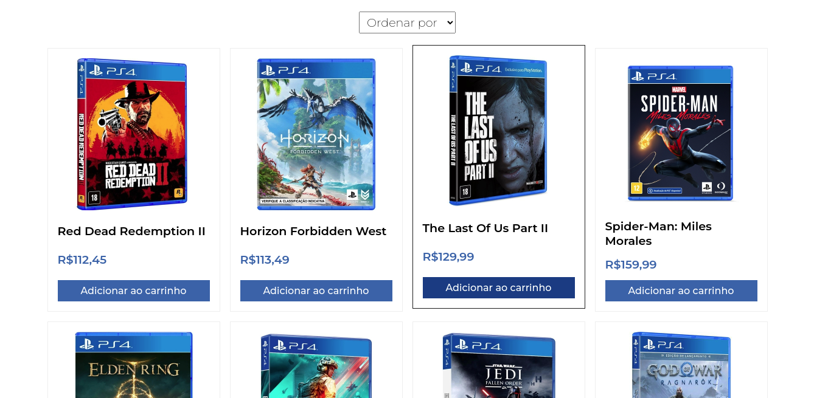
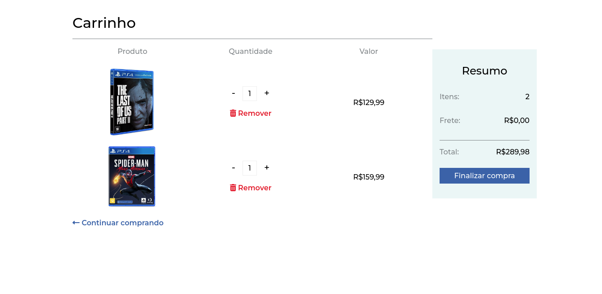

# Games Ecommerce Front-end

[](https://github.com/wendellmoraisz/GamesEcommerce-client/blob/main/LICENSE)

Ecommerce de games com autenticação de administrador e controle de estoque.

# Tecnologias utilizadas
- [TypeScript](https://www.typescriptlang.org/)
- [ReactJS](https://reactjs.org/)
- [Styled-Components](https://styled-components.com/)

# Screenshots
## Tela Inicial


## Produtos



## Carrinho



## Login de admin


## Página de Admin


# Requisitos mínimos
Ter o [Node.js](https://nodejs.org/en/download/) instalado na sua máquina.

# Como rodar o projeto

Primeiramente, inicie o [servidor](https://github.com/wendellmoraisz/GamesEcommerce-server) seguinto suas instruções.

Feito isso, execute os seguintes passos:
```bash

# clone o repositório
git clone https://github.com/wendellmoraisz/GamesEcommerce-client

#entre no diretório do projeto e execute os seguintes comandos no seu terminal:
npm install
npm start
